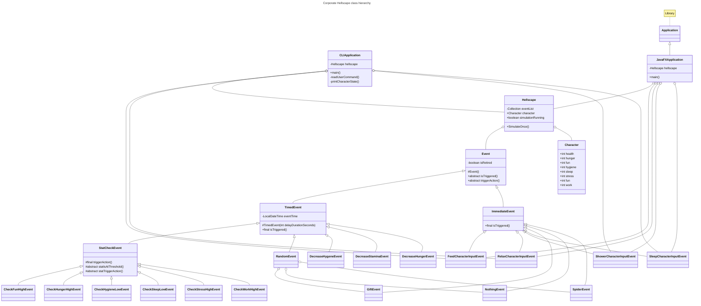

```mermaid
---
title: Corporate Hellscape class hierarchy
---
classDiagram

class Event {
    -boolean isRetired
    #Event()
    +abstract isTriggered()
    +abstract triggerAction()
}

class TimedEvent {
    -LocalDateTime eventTime
    #TimedEvent(int delayDurationSeconds)
    +final isTriggered()
}

class ImmediateEvent {
    +final isTriggered()
}

class StatCheckEvent {
    #final triggerAction()
    #abstract statIsAtThreshold()
    #abstract statTriggerAction()
}

Event <|-- TimedEvent
Event <|-- ImmediateEvent
TimedEvent <|-- StatCheckEvent

ImmediateEvent <|-- FeedCharacterInputEvent
ImmediateEvent <|-- RelaxCharacterInputEvent
ImmediateEvent <|-- ShowerCharacterInputEvent
ImmediateEvent <|-- SleepCharacterInputEvent

ImmediateEvent <|-- GiftEvent
ImmediateEvent <|-- NothingEvent
ImmediateEvent <|-- SpiderEvent
TimedEvent <|-- RandomEvent
RandomEvent o-- GiftEvent
RandomEvent o-- NothingEvent
RandomEvent o-- SpiderEvent

StatCheckEvent <|-- CheckFunHighEvent
StatCheckEvent <|-- CheckHungerHighEvent
StatCheckEvent <|-- CheckHygieneLowEvent
StatCheckEvent <|-- CheckSleepLowEvent
StatCheckEvent <|-- CheckStressHighEvent
StatCheckEvent <|-- CheckWorkHighEvent

TimedEvent <|-- DecreaseHygeneEvent
TimedEvent <|-- DecreaseStaminaEvent
TimedEvent <|-- DecreaseHungerEvent

class Hellscape {
    -Collection<Event> eventList
    +Character character
    +boolean simulationRunning
    +SimulateOnce()
}

class Character {
    +int health
    +int hunger
    +int fun
    +int hygiene
    +int sleep
    +int stress
    +int fun
    +int work
}

Hellscape o-- Event
Hellscape o-- Character

class CLIApplication {
    -Hellscape hellscape
    +main()
    -readUserCommand()
    -printCharacterState()
}

CLIApplication o-- Hellscape
CLIApplication o-- FeedCharacterInputEvent
CLIApplication o-- RelaxCharacterInputEvent
CLIApplication o-- ShowerCharacterInputEvent
CLIApplication o-- SleepCharacterInputEvent

class Application
note for Application "Library"

class JavaFXApplication {
    -Hellscape hellscape
    +main()
}

Application <|-- JavaFXApplication

JavaFXApplication o-- Hellscape
JavaFXApplication o-- FeedCharacterInputEvent
JavaFXApplication o-- RelaxCharacterInputEvent
JavaFXApplication o-- ShowerCharacterInputEvent
JavaFXApplication o-- SleepCharacterInputEvent

```